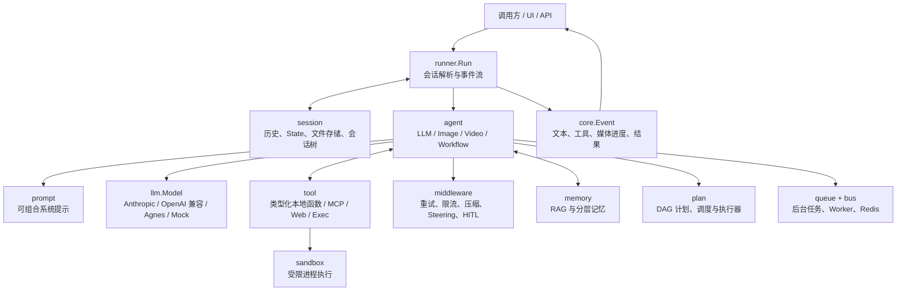

# goagent

`goagent` 是一个面向 Go 的 Agent 应用框架。它把大模型、工具调用、会话状态、记忆、工作流与运行时治理组合成统一的编程模型，让开发者能够用 Go 构建可组合、可观测、可持久化的 AI Agent、Multi-Agent 系统和多模态自动化流程。

它既适合从一个带工具调用的聊天助手开始，也适合逐步演进到包含 RAG、人工审批、并行工作流、后台队列、Redis 持久化和 DAG图式执行计划的生产型应用。

> 当前模块路径：`github.com/jiujuan/goagent`；要求 Go 1.24 或更高版本。

## 主要用途

- 构建能调用业务 API、数据库、脚本或命令行工具的智能助手。
- 构建客服、数据分析、研发助手等按领域分工的 Multi-Agent 系统。
- 编排确定性的串行、并行、循环流程，或由模型驱动的 ReAct / Plan-and-Execute 流程。
- 为 Agent 增加 RAG、分层记忆、会话持久化、上下文压缩、限流、重试和人工审核。
- 将文本、图像、视频 Agent 组合进同一套运行时，并通过后台任务队列处理长耗时任务。

## 核心特性

| 能力 | 说明 |
| --- | --- |
| 统一 Agent 抽象 | `LLMAgent`、`ImageAgent`、`VideoAgent` 共享 `Agent` 协议，可交由同一个 `Runner` 执行和组合。 |
| 类型安全工具 | 通过泛型 `tool.New` 定义 Go 函数；框架从输入结构体反射生成 JSON Schema，并负责参数校验、调用和结果回填。 |
| 多轮工具循环 | LLM 请求工具后，运行时自动执行工具、把结果写入历史，并继续调用模型直到得到最终答复；可用 `MaxSteps` 兜底。 |
| 流式事件 | `Runner.Run` 返回事件流，统一承载文本增量、工具调用、图像/视频进度和最终结果。 |
| Multi-Agent 委派 | 父 Agent 自动获得 `transfer_to_agent` 能力，可按模型判断下钻到专家、在同级间转交，并共享会话上下文与状态。 |
| 确定性工作流 | `Sequential`、`Parallel`、`Loop` 和 `Pipeline` 把控制流从模型决策中剥离，适合稳定的业务编排；并行分支支持隔离执行与有序合并。 |
| ReAct 与计划执行 | 普通 `LLMAgent` 即可完成“思考 → 调用工具 → 观察”的 ReAct 循环；`plan` 包支持带依赖的执行计划（DAG）与并发调度。 |
| 会话、分支与检查点 | 会话以追加事件和 `State` 为核心，提供内存/JSONL 文件存储、会话树分支合并，以及状态快照检查点。 |
| 记忆与 RAG | 提供向量检索、自动 RAG 注入和工具式检索；`memx` 可组合规则、项目、工作、文本与语义记忆。 |
| 技能系统 | 基于文件系统的技能包支持按需渐进加载 `SKILL.md`、资源和脚本，且可将资源通过 `go:embed` 打进二进制。 |
| 可组合中间件 | 内置重试、限流、上下文压缩、运行中 steering 和 Human-in-the-Loop；中间件可按需包裹模型。 |
| 安全执行与外部工具 | 提供受策略约束的命令沙箱、`run_command` 工具、MCP 客户端，以及网页搜索/抓取工具。 |
| 多模型与多模态 | LLM 抽象与厂商解耦，含 Anthropic、OpenAI 兼容接口和 Agnes 适配；Agnes 还支持图像、视频及可恢复的视频任务。 |
| 异步任务与事件总线 | 媒体等长任务可进入内存队列或 Redis Stream，由 Worker 后台处理并通过内存/Redis Pub/Sub 发送进度事件。 |

## 架构设计

框架以 `core` 中的消息、事件、状态和指令作为公共语言。上层 Agent 描述“谁来处理”，工具、模型、记忆和中间件提供“如何处理”，Runner 将一次输入落入会话后负责完整的执行、事件输出和持久化。



### 分层职责

- `core`：跨模块共享的数据模型，包括 `Message`、`Event`、工具调用/结果、流和状态指令。
- `agent`：实现 LLM、多模态和工作流 Agent；负责 Agent 之间的组合、委派和控制流。
- `runner`：一次运行的入口。它取得或创建会话、追加用户输入、驱动根 Agent，并逐项输出事件。
- `llm`：供应商无关的模型接口；适配器只需实现统一的请求/响应流。
- `tool`：工具契约与泛型函数工具，同时提供 `mcp`、`web`、`exec` 等现成工具。
- `session` / `checkpoint`：保存事件历史与临时结构化状态；支持内存、JSONL 文件、分支和快照。
- `memory`：长期记忆、向量检索和自动 RAG 中间件；`memx` 负责装配多层记忆。
- `middleware`：以装饰器方式包裹模型，加入通用运行时策略而不侵入 Agent 逻辑。
- `plan`、`queue`、`sandbox`：分别处理依赖计划、异步后台执行和受控外部进程。

## 安装

在你的 Go 项目中安装：

```bash
go get github.com/jiujuan/goagent
```

或克隆本仓库后直接运行示例：

```bash
git clone https://github.com/jiujuan/goagent.git
cd goagent
go test ./...
```

项目的全部无凭证示例均使用 `llm/mock` 和模拟 Embedding，因此不需要 API Key 或网络模型调用。

## Quick Start

下面是一个最小闭环：模型先请求天气工具，框架执行工具并将结果放回消息历史，模型随后给出最终答复。

```go
package main

import (
    "context"
    "fmt"

    "github.com/jiujuan/goagent/agent"
    "github.com/jiujuan/goagent/core"
    "github.com/jiujuan/goagent/llm"
    "github.com/jiujuan/goagent/llm/mock"
    "github.com/jiujuan/goagent/runner"
    "github.com/jiujuan/goagent/tool"
)

type weatherArgs struct {
    City string `json:"city" desc:"城市名"`
}

func main() {
    weather := tool.New("get_weather", "查询某城市的当前天气",
        func(_ *tool.Context, in weatherArgs) (string, error) {
            return in.City + "：晴，25°C", nil
        })

    model := mock.New("mock", func(req *llm.Request) *llm.Response {
        if result, ok := mock.LastToolResult(req); ok {
            return mock.Text("天气结果：" + result.Content[0].(core.Text).Text)
        }
        return mock.CallTool("call_1", "get_weather", `{"city":"北京"}`)
    })

    assistant := agent.New(agent.Config{
        Name:        "assistant",
        Description: "天气助手",
        Instruction: "你是一个友好的天气助手。",
        Model:       model,
        Tools:       []tool.Tool{weather},
    })

    r := runner.New(runner.Config{Root: assistant})
    for event, err := range r.Run(context.Background(), "user-1", "session-1",
        core.UserText("北京天气怎么样？")) {
        if err != nil {
            panic(err)
        }
        if event.Message != nil {
            fmt.Println(event.Message.Role, event.Message.Text())
        }
    }
}
```

直接运行仓库中的完整 Quick Start：

```bash
go run ./examples/quickstart
```

将 mock 模型替换成 `llm/anthropic` 或 `llm/openaicompat` 的模型实现，即可接入对应的真实文本模型；图像和视频场景可使用 `llm/agnes`。请将密钥放在运行环境中，不要写入源码或提交到版本库。

## 常用开发命令

| 命令 | 用途 |
| --- | --- |
| `go test ./...` | 运行全部测试。 |
| `go run ./examples/quickstart` | 运行最小工具调用闭环。 |
| `go run ./examples/full` | 运行多 Agent、RAG、中间件和持久化综合示例。 |
| `go run ./examples/workflow` | 运行确定性并行/循环工作流。 |
| `go run ./examples/react` | 观察 ReAct 的多步工具调用轨迹。 |

## 示例目录详解

示例均是独立的 `main` 包，优先阅读文件顶部注释，再运行相应命令。除特别标注的示例外，均无需密钥。

| 示例 | 运行方式 | 展示内容 |
| --- | --- | --- |
| `quickstart` | `go run ./examples/quickstart` | 最小 Agent：类型化天气工具、模型工具请求、自动执行与最终回答。 |
| `full` | `go run ./examples/full` | 智能客服综合场景：专家路由、RAG、流式、重试、steering、压缩、限流和 JSONL 恢复。 |
| `multiagent` | `go run ./examples/multiagent` | 路由 Agent 根据专家描述委派给天气、账单等子 Agent。 |
| `subagent` | `go run ./examples/subagent` | 三级 Agent 树的下钻、同级转交、工具调用与共享状态。 |
| `workflow` | `go run ./examples/workflow` | `Sequential + Parallel + Loop` 组成营销文案流水线；并发调研、汇总、评审与修订。 |
| `pipeline` | `go run ./examples/pipeline` | ETL 风格的顺序管道：清洗、分类、评分、报告通过 `session.State` 传递结构化数据。 |
| `pipeline/builder` | `go run ./examples/pipeline/builder` | 以构建器 API 组装数据管道与阶段依赖。 |
| `react` | `go run ./examples/react` | 单个 Agent 多轮“思考 → 工具 → 观察”循环：查票价、计算、查汇率、换算。 |
| `plan-execute` | `go run ./examples/plan-execute` | 规划器拆分任务、执行器逐步执行、汇总器生成交付物的三阶段模式。 |
| `plan-dag` | `go run ./examples/plan-dag` | 具有依赖关系的执行计划图；无依赖步骤并发执行，依赖满足后继续调度。 |
| `plan-dag/backends` | `go run ./examples/plan-dag/backends` | 比较计划执行的不同后端与执行器接入方式。 |
| `prompt` | `go run ./examples/prompt` | 用身份、环境、工具指导和会话状态等可组合 Section 构建系统提示。 |
| `persistent` | `go run ./examples/persistent` | JSONL 文件会话跨进程恢复；多次运行可看到历史增长。 |
| `sessiontree` | `go run ./examples/sessiontree` | 会话树的创建分支、切换、合并、列举与文件持久化重摘要。 |
| `memory-layers` | `go run ./examples/memory-layers` | 规则、项目、工作、文本和语义记忆的分层装配、注入、沉淀与恢复。 |
| `rag` | `go run ./examples/rag` | 同一知识库的两种检索：RAG 中间件自动注入，以及模型主动调用 `search_memory`。 |
| `skills` | `go run ./examples/skills` | 技能三层渐进披露：发现技能、读取 `SKILL.md`/资源、在沙箱执行脚本。 |
| `skills-analyst` | `go run ./examples/skills-analyst` | 真实模型驱动的销售分析技能，读取嵌入资源并执行 Python 统计脚本；需要 Agnes 凭证和 Python。 |
| `skills-toolbelt` | `go run ./examples/skills-toolbelt` | 真实模型在提交信息、slug 与密钥扫描等多个技能间自主路由；需要 Agnes 凭证和 Python。 |
| `hitl` | `go run ./examples/hitl` | 高风险工具调用的人工批准、拒绝与改参；真实应用可换成控制台或业务审批器。 |
| `sandbox` | `go run ./examples/sandbox` | 受限 `run_command` 工具：工作目录、超时、输出、环境变量和命令白名单策略。 |
| `mcp` | `go run ./examples/mcp` | 连接 MCP 服务并把远程工具提供给 Agent；默认使用进程内模拟服务，也展示真实 stdio 接入方式。 |
| `websearch` | `go run ./examples/websearch` | `web_search` 与 `web_fetch` 工具教程；前四课离线，设置 `WEB_LIVE=1` 可额外请求 DuckDuckGo。 |
| `media` | `go run ./examples/media` | 视频 Agent 后台入队、非阻塞返回，并通过事件总线流式接收进度与结果。 |
| `media-redis` | `REDIS_URL=redis://localhost:6379/0 go run ./examples/media-redis` | Redis Stream 队列和 Redis Pub/Sub 事件总线；先启动 Redis。 |
| `media/chain` | `go run ./examples/media/chain` | 文本扩写、文生图、文生视频组成一个顺序工作流，消费者统一处理多模态事件。 |
| `media/image` | `AGNES_API_KEY=... go run ./examples/media/image "提示词"` | 多个 ImageAgent 并行生成不同尺寸的海报并保存至 `./out`；需要 Agnes 凭证。 |
| `media/video` | `AGNES_API_KEY=... go run ./examples/media/video` | 提交并轮询视频生成任务；支持 `resume <job-id>` 恢复未完成的远程任务；需要 Agnes 凭证。 |

## 从示例走向应用

1. 从 `examples/quickstart` 复制 Agent、工具和 `Runner` 的最小骨架。
2. 使用真实模型适配器替换 `llm/mock`，并通过环境变量或密钥管理服务注入凭证。
3. 需要连续对话时，在 `runner.Config` 中传入 `session.InMemory()` 或 `session.NewFileStore(...)`。
4. 有知识库需求时，为 Agent 加入 `memory.NewRAG(...)`，或提供检索工具让模型按需调用。
5. 业务步骤固定时用 `Sequential` / `Parallel` / `Loop`；需要领域专家协作时配置 `SubAgents`。
6. 对外部命令、删除、支付等高风险动作，同时使用 `sandbox` 与 `middleware.HumanInTheLoop(...)`。

## 目录概览

```text
agent/        Agent 实现与组合式工作流
core/         消息、事件、状态等公共模型
llm/          模型抽象及厂商适配器
tool/         类型化工具、MCP、Web 与命令执行工具
runner/       运行入口与事件驱动
session/      会话、状态、分支树和存储
memory/       RAG、向量/文本/规则/项目/工作记忆
middleware/   重试、限流、压缩、Steering、HITL
plan/         执行计划、DAG 调度与执行器
queue/        后台任务队列和事件总线
sandbox/      外部进程执行策略与默认实现
skill/        文件系统技能包与脚本资源
examples/     可独立运行的端到端示例
```

## 贡献与反馈

欢迎通过 Issue 或 Pull Request 提交问题、示例和改进。提交前请至少运行：

```bash
go test ./...
```
