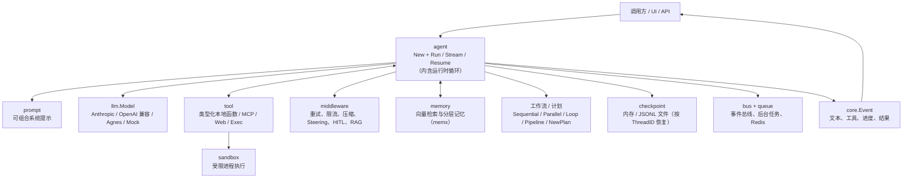

# goagent

`goagent` 是一个面向 Go 的 Agent 应用框架。它把大模型、工具调用、运行状态、记忆、工作流与运行时治理组合成统一的编程模型，让开发者能够用 Go 构建可组合、可观测、可持久化的 AI Agent 与 Multi-Agent 系统。

它既适合从一个带工具调用的聊天助手开始，也适合逐步演进到包含 RAG、人工审批、并行工作流、后台队列、Redis 持久化和 DAG 图式执行计划的生产型应用。

> 当前模块路径：`github.com/jiujuan/goagent`；要求 Go 1.25 或更高版本。

## 主要用途

- 构建能调用业务 API、数据库、脚本或命令行工具的智能助手。
- 构建客服、数据分析、研发助手等按领域分工的 Multi-Agent 系统。
- 编排确定性的串行、并行、循环流程，或由模型驱动的 ReAct / Plan-and-Execute 流程。
- 为 Agent 增加 RAG、分层记忆、跨进程持久化、上下文压缩、限流、重试和人工审核。
- 通过后台任务队列（内存或 Redis）处理长耗时任务，并通过事件总线流式接收进度。

## 核心特性

| 能力 | 说明 |
| --- | --- |
| 单一执行包 | 无独立 `runtime`/`runner` 包：`agent.New` 构建 Agent，`Run`（阻塞返回答案）与 `Stream`（非阻塞事件流）即完整入口。 |
| 类型安全工具 | 通过泛型 `tool.New` 定义 Go 函数；框架从输入结构体反射生成 JSON Schema，并负责参数校验、调用和结果回填。 |
| 多轮工具循环 | LLM 请求工具后，运行时自动执行工具、把结果写入历史，并继续调用模型直到得到最终答复；用 `WithMaxTurns` 兜底。 |
| 流式事件 | `Stream(...).Iter()` 产出一串类型化的 `core.Event`（`MessageDelta`、`MessageDone`、`ToolDone`、`Interrupted` 等），统一承载文本增量、工具调用与最终结果。 |
| Multi-Agent 委派 | 配置 `WithSubAgents` 后自动获得 `transfer_to_agent` 能力（模型驱动下钻/同级转交）；也可用 `AsTool` 把子 Agent 封装成隔离上下文的工具。 |
| 确定性工作流 | `Sequential`、`Parallel`、`Loop` 和 `Pipeline` 把控制流从模型决策中剥离；并行分支在隔离的 `State` 克隆上运行，结束后按声明顺序确定性地合并 KV（可选冲突策略）。 |
| ReAct 与计划执行 | 普通 Agent 即可完成“思考 → 调用工具 → 观察”的 ReAct 循环；`agent.NewPlan` / `agent.NewLLMPlan` 提供带依赖的执行计划（DAG）与并发调度。 |
| 状态与检查点 | 运行状态为显式的 `core.State`（消息、Todos、KV、文件）；`checkpoint` 提供内存与 JSONL 文件后端，支持按 `ThreadID` 跨进程恢复。 |
| 记忆与 RAG | `memory` 提供向量检索（`NewRetriever`）；`middleware.RAG` 自动把检索结果注入系统提示；`memx` 可组合规则、项目、工作、文本记忆。 |
| 技能系统 | `skills` 基于文件系统的技能包支持按需渐进加载 `SKILL.md`、资源和脚本，可将资源通过 `go:embed` 打进二进制。 |
| 可组合中间件 | 内置重试、限流、上下文压缩、运行中 steering 和 Human-in-the-Loop；中间件以装饰器方式包裹模型。 |
| 安全执行与外部工具 | 提供受策略约束的命令沙箱（`sandbox`）、MCP 客户端（`tool/mcp`）以及网页搜索/抓取工具（`tool/web`）。 |
| 多模型与多模态 | `llm` 抽象与厂商解耦，含 Anthropic、OpenAI 兼容接口、Agnes 适配与 Mock；`llm/agnes` 客户端另提供图像生成与可轮询/恢复的视频任务。 |
| 韧性与可观测性 | `llm` 韧性层支持多供应商回退与熔断；`obs/otel` 接入 OpenTelemetry 追踪；`logger` 基于 zerolog；`config` 基于 viper；`eval` 提供打分/评测。 |
| 异步任务与事件总线 | `queue` 支持内存队列与 Redis Stream，由 Worker 池后台处理；`bus` 提供进程内 pub/sub，Redis 后端可跨进程发送进度事件。 |

## 架构设计

框架以 `core` 中的消息、事件、状态和指令作为公共语言。`agent` 既是 Agent 的声明（配置）也是可运行句柄——它自身就是运行时，没有独立的 runner/runtime 层：一次 `Run`/`Stream` 会加载状态、驱动模型与工具循环、发布事件并写检查点。



### 分层职责

- `core`：跨模块共享的数据模型——`Message`、`Event`（类型化事件）、`State`、工具调用/结果、指令（Directive）。
- `agent`：Agent 的声明与运行时本身；实现 LLM 循环、工作流（Sequential/Parallel/Loop/Pipeline）、DAG 计划、委派与 HITL。
- `llm`：供应商无关的模型接口与韧性层；适配器只需实现统一的请求/响应流（`anthropic`、`openaicompat`、`agnes`、`mock`）。
- `tool`：工具契约与泛型函数工具，另提供 `mcp`、`web`、`exec` 等现成工具。
- `checkpoint`：显式状态快照的持久化——内存与 JSONL 文件后端，支撑跨进程 resume。
- `memory`：向量检索与自动 RAG；`memx` 装配规则/项目/工作/文本多层记忆。
- `middleware`：以装饰器方式包裹模型，加入重试、限流、压缩、steering、HITL、RAG 等通用策略。
- `prompt`：可组合的系统提示 Section（身份、环境、工具指导、状态）。
- `bus`、`queue`、`sandbox`、`vfs`：事件总线、异步后台执行、受控外部进程、虚拟文件系统后端。
- `config`、`logger`、`eval`、`obs/otel`：配置、日志、评测与可观测性等运行时治理设施。

## 安装

在你的 Go 项目中安装：

```bash
go get github.com/jiujuan/goagent
```

或克隆本仓库后直接运行示例：

```bash
git clone https://github.com/jiujuan/goagent.git
cd goagent
go test ./...
```

离线示例均使用 `llm/mock` 和模拟 Embedding，因此不需要 API Key 或网络模型调用。

## Quick Start

下面是一个最小闭环：模型先请求天气工具，框架执行工具并将结果放回消息历史，模型随后给出最终答复。`Run` 一行拿到答案，`Stream(...).Iter()` 则可观察同一次运行的事件流。

```go
package main

import (
	"context"
	"fmt"
	"log"

	"github.com/jiujuan/goagent/agent"
	"github.com/jiujuan/goagent/core"
	"github.com/jiujuan/goagent/llm"
	"github.com/jiujuan/goagent/llm/mock"
	"github.com/jiujuan/goagent/tool"
)

func main() {
	// 类型化工具：JSON schema 从参数结构体反射生成。
	weather := tool.New("get_weather", "查询某城市的当前天气",
		func(_ *tool.Context, in struct {
			City string `json:"city" desc:"城市名"`
		}) (string, error) {
			return in.City + "：晴，25°C", nil
		})

	// mock 模型：首轮请求工具，拿到工具结果后给出最终答复。
	model := mock.New("mock", func(req *llm.Request) *llm.Response {
		if tr, ok := mock.LastToolResult(req); ok {
			return mock.Text("天气结果：" + tr.Content[0].(core.Text).Text)
		}
		return mock.CallTool("c1", "get_weather", `{"city":"北京"}`)
	})

	a, err := agent.New(
		agent.WithModel(model),
		agent.WithInstruction("你是一个友好的天气助手。"),
		agent.WithTools(weather),
		agent.WithMaxTurns(8), // 模型<->工具循环的安全上限
	)
	if err != nil {
		log.Fatal(err)
	}

	ctx := context.Background()

	// A) 一行拿到答案。
	answer, err := a.Run(ctx, "北京天气怎么样？")
	if err != nil {
		log.Fatal(err)
	}
	fmt.Println("answer:", answer)

	// B) 或流式观察同一次运行的事件。
	for ev, err := range a.Stream(ctx, "上海呢？").Iter() {
		if err != nil {
			log.Fatal(err)
		}
		switch e := ev.(type) {
		case core.ToolDone:
			fmt.Printf("🔧 %s -> %s\n", e.Result.Name, e.Result.Content[0].(core.Text).Text)
		case core.MessageDone:
			if t := e.Message.Text(); t != "" {
				fmt.Println("🤖", t)
			}
		}
	}
}
```

直接运行仓库中的完整 Quick Start：

```bash
go run ./examples/quickstart
```

把 mock 模型替换成 `llm/anthropic` 或 `llm/openaicompat` 的模型实现，即可接入真实文本模型；图像和视频场景可使用 `llm/agnes` 客户端。请将密钥放在运行环境中，不要写入源码或提交到版本库。

## 常用开发命令

| 命令 | 用途 |
| --- | --- |
| `go test ./...` | 运行全部测试。 |
| `go build ./...` | 编译全部包与示例。 |
| `go run ./examples/quickstart` | 运行离线最小工具调用闭环（无需密钥）。 |
| `go run ./examples/workflow` | 运行确定性串行/并行/循环工作流（需 Agnes 凭证）。 |
| `go run ./examples/react-agent` | 观察 ReAct 的多步工具调用轨迹。 |

## 示例目录详解

示例均是独立的 `main` 包，优先阅读文件顶部注释，再运行相应命令。使用真实模型的示例需要设置对应环境变量（多为 `AGNES_API_KEY` / `AGNES_MODEL`），未设置时通常只打印用法后退出。

### 入门与核心循环

| 示例 | 运行方式 | 展示内容 |
| --- | --- | --- |
| `quickstart` | `go run ./examples/quickstart` | 离线冒烟测试：mock 模型上的类型化工具调用与流式事件。 |
| `quickstart-chat` | `go run ./examples/quickstart-chat` | 真实模型的最小聊天启动模板。 |
| `quickstart-tool` | `go run ./examples/quickstart-tool` | 真实模型调用一个类型化工具的启动模板。 |
| `quickstart-stream` | `go run ./examples/quickstart-stream` | 流式接收真实模型输出的启动模板。 |
| `agent-tutorial` | `go run ./examples/agent-tutorial` | 对公共 API 的引导式完整走读。 |
| `react-agent` | `go run ./examples/react-agent` | 单 Agent 多轮“思考 → 工具 → 观察”的 ReAct 循环。 |

### 多 Agent 与工作流

| 示例 | 运行方式 | 展示内容 |
| --- | --- | --- |
| `multiagent` | `go run ./examples/multiagent` | 多 Agent 委派：`transfer_to_agent` 与 agent-as-tool。 |
| `multi-subagent` | `go run ./examples/multi-subagent` | 三级 Agent 树：顶层协调者委派给两个子专家。 |
| `subagent` | `go run ./examples/subagent` | 通过 `AsTool` 实现子 Agent 的上下文隔离。 |
| `workflow` | `go run ./examples/workflow` | `Sequential + Parallel + Loop` 与 Pipeline 构建器的编排教程。 |
| `pipeline` | `go run ./examples/pipeline` | 用 Pipeline 构建器以流水线方式组装多阶段流程。 |
| `refine` | `go run ./examples/refine` | 用 `Loop` 工作流做迭代式精炼，`exit_loop` 收敛退出。 |

### 计划执行（DAG）

| 示例 | 运行方式 | 展示内容 |
| --- | --- | --- |
| `planning` | `go run ./examples/planning` | 对比 `write_todos` 软规划与工作流硬执行的差异。 |
| `plan-dag` | `go run ./examples/plan-dag` | `agent.NewPlan` 的 DAG 执行器：带依赖的节点、真并发、最终审批与崩溃恢复。 |
| `plan-llm` | `go run ./examples/plan-llm` | LLM 生成计划（`agent.NewLLMPlan`）而非手工构建 DAG。 |
| `plan-approval` | `go run ./examples/plan-approval` | DAG 计划中的逐节点人工审批。 |
| `plan-replan` | `go run ./examples/plan-replan` | 动态重规划：执行器在运行中改写剩余计划。 |

### 记忆、RAG 与技能

| 示例 | 运行方式 | 展示内容 |
| --- | --- | --- |
| `memory-layers` | `go run ./examples/memory-layers` | 规则、项目、工作、文本记忆的分层装配、注入与恢复。 |
| `skills` | `go run ./examples/skills` | 技能三层渐进披露：发现技能、读取 `SKILL.md`/资源、在沙箱执行脚本。 |
| `prompt` | `go run ./examples/prompt` | 用身份、环境、工具指导、状态等可组合 Section 构建系统提示。 |

### 中间件、HITL 与外部工具

| 示例 | 运行方式 | 展示内容 |
| --- | --- | --- |
| `middleware` | `go run ./examples/middleware` | 中间件教程：重试、限流、压缩、steering、RAG 等横切策略。 |
| `middleware-hooks` | `go run ./examples/middleware-hooks` | 把循环的六个阶段作为显式钩子逐一观察。 |
| `mcp` | `go run ./examples/mcp` | 连接 MCP 服务并把远程工具提供给 Agent。 |
| `websearch` | `go run ./examples/websearch` | `web_search` 与 `web_fetch` 工具教程（默认离线）。 |

### 持久化、后台任务与运行时治理

| 示例 | 运行方式 | 展示内容 |
| --- | --- | --- |
| `persistent` | `go run ./examples/persistent` | 基于文件检查点的跨进程持久化运行；多次运行可见历史增长。 |
| `background` | `go run ./examples/background` | 队列驱动的后台执行：入队任务由 Worker 处理。 |
| `redis` | `go run ./examples/redis` | 基于 Redis 的持久化后台队列（需先启动 Redis）。 |
| `resilience` | `go run ./examples/resilience` | LLM 韧性层：多供应商回退与熔断。 |
| `config` | `go run ./examples/config` | 配置系统（基于 viper）的完整用法。 |
| `logger` | `go run ./examples/logger` | 日志系统（基于 zerolog）的用法。 |
| `otel` | `go run ./examples/otel` | 通过 `obs/otel` 接入 OpenTelemetry 追踪。 |

### 评测（eval）

| 示例 | 运行方式 | 展示内容 |
| --- | --- | --- |
| `eval-quickstart` | `go run ./examples/eval-quickstart` | 最小评测：对单个回答打分。 |
| `eval-dataset` | `go run ./examples/eval-dataset` | 对小型数据集运行打分评测。 |
| `eval-judge` | `go run ./examples/eval-judge` | LLM-as-judge：基于评分标准的打分。 |
| `eval-tool` | `go run ./examples/eval-tool` | 工具使用评测：检查工具调用是否正确。 |
| `eval-trajectory` | `go run ./examples/eval-trajectory` | 轨迹评测：不仅评结果，也评过程。 |
| `eval-reflect` | `go run ./examples/eval-reflect` | 自我反思：Agent 对自身输出进行批评与修订。 |

## 从示例走向应用

1. 从 `examples/quickstart` 复制 Agent 与工具的最小骨架，用 `agent.New(...)` + `Run`/`Stream`。
2. 用真实模型适配器替换 `llm/mock`，并通过环境变量或密钥管理服务注入凭证。
3. 需要连续对话与跨进程恢复时，用 `agent.WithCheckpointer(checkpoint.NewFile(dir))`，并在运行时用 `agent.OnThread(id)` 指定线程。
4. 有知识库需求时，用 `memory.NewRetriever(...)` 配合 `middleware.RAG(...)` 自动注入，或提供检索工具让模型按需调用。
5. 业务步骤固定时用 `Sequential` / `Parallel` / `Loop` / `Pipeline`；带依赖的复杂任务用 `agent.NewPlan`；需要领域专家协作时配置 `WithSubAgents` 或 `AsTool`。
6. 对外部命令、删除、支付等高风险动作，同时使用 `sandbox` 与 `middleware.Permission(...)`。

## 目录概览

```text
agent/        Agent 声明与运行时；工作流与 DAG 计划
core/         消息、事件、状态、指令等公共模型
llm/          模型抽象、韧性层及厂商适配器（anthropic/openaicompat/agnes/mock）
tool/         类型化工具、MCP、Web 与命令执行工具
checkpoint/   显式状态快照持久化（内存 / JSONL 文件）
memory/       向量检索、RAG 与分层记忆（memx/rules/projectmem/workingmem/textmem）
middleware/   重试、限流、压缩、Steering、HITL、RAG
prompt/       可组合系统提示 Section
bus/          进程内事件总线（pub/sub）
queue/        后台任务队列与 Worker 池（内存 / Redis Stream）
sandbox/      外部进程执行策略与默认实现
skills/       文件系统技能包与脚本资源
vfs/          虚拟文件系统后端（core.FileStore 实现）
config/       配置系统（基于 viper）
logger/       日志系统（基于 zerolog）
eval/         评测与打分
obs/          可观测性（OpenTelemetry 集成）
examples/     可独立运行的端到端示例
```

## 贡献与反馈

欢迎通过 Issue 或 Pull Request 提交问题、示例和改进。提交前请至少运行：

```bash
go test ./...
```
