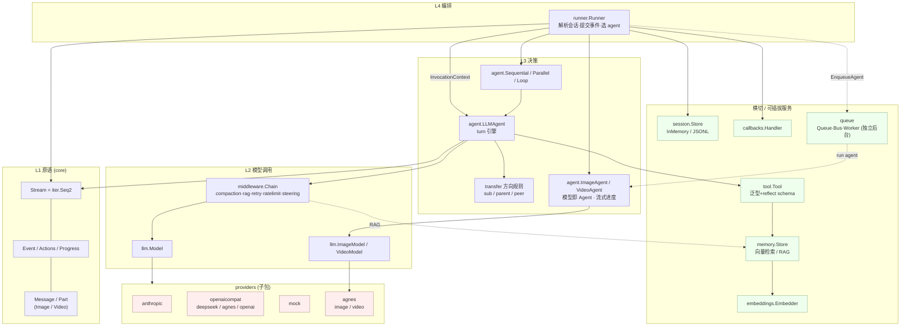
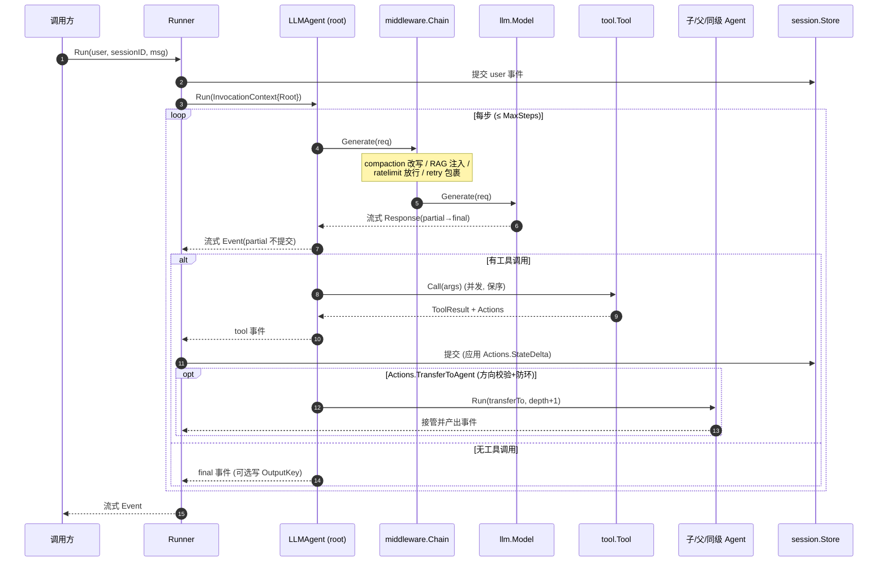

# goagent 顶层架构

> 一句话理念：**一切皆事件流；事件即数据；能力即中间件；接口尽量小。**

## 分层与包

每一层都返回 `core.Stream`（`iter.Seq2[*core.Event, error]`）。消费者用
`for ev, err := range stream` 驱动，提前 `break`/`return` 即可干净停止上游。

## 一次 turn 的时序（含工具调用与委派）

## 关键不变量

- **事件即数据**：状态变更/委派/控制信号都挂在 `Event.Actions`，由 Runner 在**提交
  非 partial 事件**时事务性应用 → 可重放、可审计、可持久化。
- **决策/执行分离**：Agent 只决策并产出事件流，**只有 Runner 持久化**。
- **provider 无关**：上层只认 `core.Message`，provider 子包在调用边界做 wire 转换。
- **能力即中间件**：compaction/RAG/retry/ratelimit/steering 都是 `func(llm.Model) llm.Model`
  装饰器，任意组合排序，turn 引擎不感知具体能力。
- **可插拔服务**：`llm.Model` / `tool.Tool` / `session.Store` / `memory.Store` /
  `embeddings.Embedder` / `callbacks.Handler` 全是小接口，换实现不动核心。

## 设计来源对照

| 精华 | 来源 |
|---|---|
| `iter.Seq2` 全栈流式 · 事件Event 驱动（Event.Actions）· workflow/transfer · 泛型工具 | google/adk-go |
| 内部消息↔wire 边界转换 · 上下文压缩 · JSONL 持久化 · 统一错误流 | earendil-works/pi |
| 小接口 · functional options · 中心 schema(core) · 决策/执行分离 · provider 子包 | tmc/langchaingo |

详见各 [ADR](adr/) 与 [DESIGN.md](DESIGN.md)。
